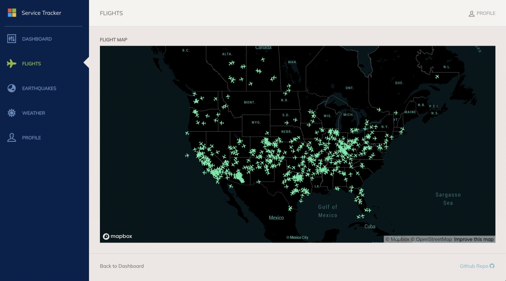

# provider-alibaba

## Overview

`provider-alibaba` is the Crossplane infrastructure provider for [Alibaba
Cloud](https://alibabacloud.com). The provider that is built from the source
code in this repository can be installed into a Crossplane control plane and
adds the following new functionality:

* Custom Resource Definitions (CRDs) that model Alibaba Cloud infrastructure and
  services
* Controllers to provision these resources in Alibaba Cloud based on the users
  desired state captured in CRDs they create
* Implementations of Crossplane's portable resource abstractions, enabling
  Alibaba Cloud resources to fulfill a user's general need for cloud services

## Getting Started

In the following, We will deploy flight tracker app using OAM and Alibaba RDS resource:



Make sure you have installed:

- [kind](https://kind.sigs.k8s.io/docs/user/quick-start/#installation)
- kubectl
- [helm](https://helm.sh/)

Then set up the environment on first trial:

```bash
helm repo add crossplane-master https://charts.crossplane.io/master/
git clone git@github.com:crossplane/addon-oam-kubernetes-local.git ../addon-oam-kubernetes-local
export ACCESS_KEY_ID=<your-access-key-id>
export ACCESS_KEY_SECRET=<your-access-key-secret>
```

Access key should be obtained via Alibaba cloud.

Then run command:
```bash
make demo
```
This will deploy the [Crossplane](https://github.com/crossplane/crossplane), [addon-oam-kubernetes-local](https://github.com/crossplane/addon-oam-kubernetes-local), setting up cloud provider, and finally deploy an OAM app with a cloud RDS database.

Use the following script to wait until the database and the app has been deployed successfully and do port-forward:

```bash
#!/usr/bin/env bash

until kubectl port-forward deployment/web-ui 8080:8080 --address 0.0.0.0; do
  sleep 5
done
```

The demo app could be access at http://localhost:8080 .

## Contributing

provider-alibaba is a community driven project and we welcome contributions. See
the Crossplane [Contributing](https://github.com/crossplane/crossplane/blob/master/CONTRIBUTING.md)
guidelines to get started.

## Report a Bug

For filing bugs, suggesting improvements, or requesting new features, please
open an [issue](https://github.com/crossplane-contrib/provider-alibaba/issues).

## Contact

Please use the following to reach members of the community:

* Slack: Join our [slack channel](https://slack.crossplane.io)
* Forums: [crossplane-dev](https://groups.google.com/forum/#!forum/crossplane-dev)
* Twitter: [@crossplane_io](https://twitter.com/crossplane_io)
* Email: [info@crossplane.io](mailto:info@crossplane.io)

## Roadmap

provider-alibaba goals and milestones are currently tracked in the Crossplane
repository. More information can be found in
[ROADMAP.md](https://github.com/crossplane/crossplane/blob/master/ROADMAP.md).

## Governance and Owners

provider-alibaba is run according to the same
[Governance](https://github.com/crossplane/crossplane/blob/master/GOVERNANCE.md)
and [Ownership](https://github.com/crossplane/crossplane/blob/master/OWNERS.md)
structure as the core Crossplane project.

## Code of Conduct

provider-alibaba adheres to the same [Code of
Conduct](https://github.com/crossplane/crossplane/blob/master/CODE_OF_CONDUCT.md)
as the core Crossplane project.

## Licensing

provider-alibaba is under the Apache 2.0 license.

[](https://app.fossa.io/projects/git%2Bgithub.com%2Fcrossplane%2Fprovider-alibaba?ref=badge_large)
